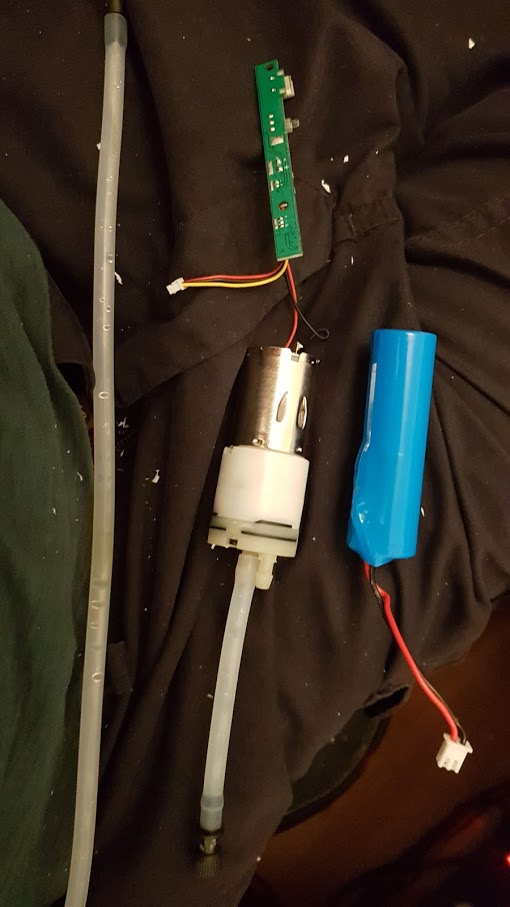

# Drone Sprayer
This project is to create an Arduino powered drone sprayer. It will be a separate, underslung load, rather than interfacing with the drone itself.

## Parts
1 - [Battery Powered/USB 1L Sprayer](https://www.amazon.co.uk/dp/B083M8X6PG/ref=cm_sw_em_r_mt_)
1 - ESP32 board - [(I used a Heltec Wireless Stick Lite)](https://heltec.org/project/wireless-stick-lite/)
1 - Breadboard - I will probably make a perf board at one point, but breadboard for now
1 - 500ml plastic bottle - I used an empty Caro container, as it was thin, light plastic

## Process

First, I stripped down the sprayer. 

Ended up with 4 main parts.

- Sprayer pump
- 18650 battery
- Control board
- Sprayer head & pipe

There is a TC4056A chip controlling the charge for the battery. 3 molex connectors for the battery (large 2 pin), motor (2 pin, small), and trigger (3 pin, small).
There is 1 other 6pin chip, but I cannot make out the lettering, and 3x 3 pin MOSFETS or similar, again, with unidentifiable IDs. I haven't bothered to figure out the routing, just enough to make it work.
On the small 3 pin molex there are 3 wires: red, black and yellow. Red is carrying the +ve straight from the battery it seems. black is GND, and the yellow is held high. When it is pulled low - it triggers the sprayer.

## What next?

> Written with [StackEdit](https://stackedit.io/).
