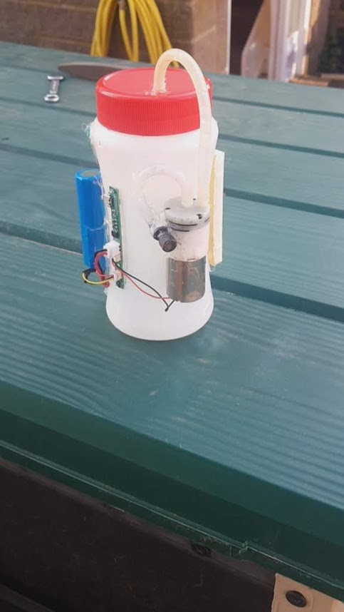
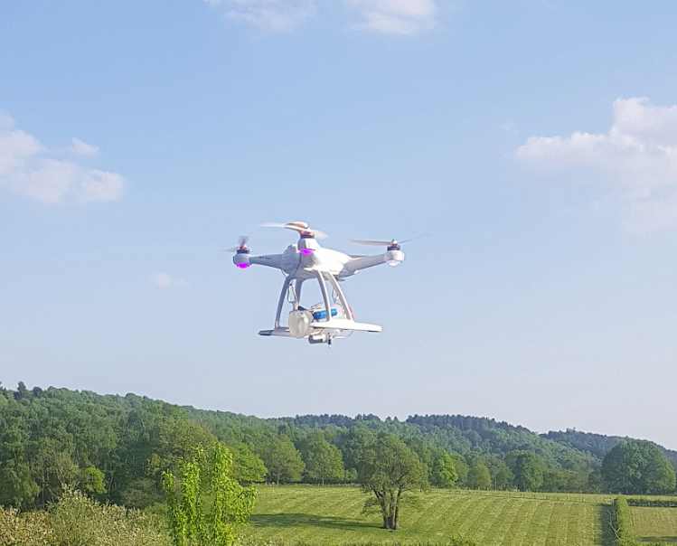

# Drone Sprayer
This project is to create an Arduino powered drone sprayer. It will be a separate, underslung load, rather than interfacing with the drone itself.

## Parts
1 - [Battery Powered/USB 1L Sprayer](https://www.amazon.co.uk/dp/B083M8X6PG/ref=cm_sw_em_r_mt_)
1 - ESP32 board - [(I used a Heltec Wireless Stick Lite)](https://heltec.org/project/wireless-stick-lite/)
1 - Breadboard - I will probably make a perf board at one point, but breadboard for now
1 - 500ml plastic bottle - I used an empty Caro container, as it was thin, light plastic

## Process

First, I stripped down the sprayer. 
Ended up with 4 main parts.

- Sprayer pump
- 18650 battery
- Control board
- Sprayer head & pipe

There is a TC4056A chip controlling the charge for the battery. 3 molex connectors for the battery (large 2 pin), motor (2 pin, small), and trigger (3 pin, small).
There is 1 other 6pin chip, but I cannot make out the lettering, and 3x 3 pin MOSFETS or similar, again, with unidentifiable IDs. I haven't bothered to figure out the routing, just enough to make it work.
On the small 3 pin molex there are 3 wires: red, black and yellow. Red is carrying the +ve straight from the battery it seems. black is GND, and the yellow is held high. When it is pulled low - it triggers the sprayer.

## What next?
Firstly - I ran it with just a switch to pull it low. This didn't work well. The spray time to drain 500ml was only 2 minutes - so switching it on, taking off and flying to the area - it would be out of spray by the time it arrived on station.

So - an arduino/ESP32 for wireless control.

### ESP32
I used a Heltec ESP32 Wireless Stick Lite - mainly because I had it laying about. 
The code used is a very simply modified version of the example code - in the [DroneSprayer folder](https://github.com/Skipper-is/Drone-Sprayer/tree/master/DroneSprayer)
Pin 5 was linked to the yellow signal wire from the trigger connector, the red & black were wired to the Wireless Stick Lite's LiPo terminal. 
Everything was hot-glued to the Caro coffee container, with the sprayer input pipe going into the container.

A switch was added to the +ve wire running to the ESP32, so it isn't running when not in use. I suppose I could do a switch on the battery - but then I cannot charge it unless the whole system is active.

## Testing

Using a Yuneec Blade Chroma 4K drone, whos camera has died, I did the first test. Prior to lofting the sprayer, I did a load test with the drone, and found it could manage 1kg/1000g with very little issue. The main issue came from the long piece of baler twine (...farm...) I used to attatch the load. This introduced a lot of swinging from the load, and the drone struggled a little to maintain attitude. 
The container, complete with hot-glued components, was connected to the drone using small carabiner clips to allow for rapid refilling when spraying. 
For the first test, I filled it wih 500ml of water. Dry load is 210g, so a total mass of 710g. 

The flight was succesful, and the drone held position very well with the less dynamic load. The sprayer could be activated from the phone, and managed to discharge the 500ml of water in approximately 2 minutes. 

## Field test
I then ran a field test, using Bacillus thuringiensis kurstaki (Dipel DF) on apple trees to control an infestation of winter moth. Again, the load was similar, 500ml of spray, so mass was the same +-a few g. 
Flight performance was good, the only issues were that the sprayer kept clogging with the spray. The inline filter is not adequet for preventing cloggage of the nozzle. I think for future use I will need to filter the spray before it goes in the tank. A coffee filter paper would work well for this.

> Written with [StackEdit](https://stackedit.io/).
